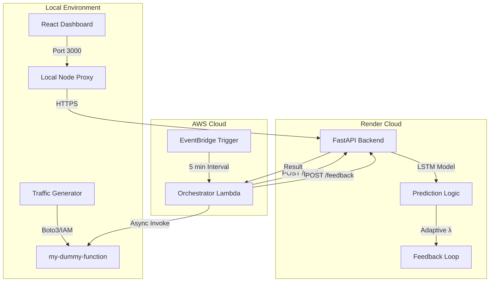

# 🚀 Adaptive Cold-Start Predictor & Pre-Warmer for AWS Lambda

This research project implements an end-to-end system for predicting and eliminating cold starts in AWS Lambda using **Stacked LSTM Forecasting** and an **Adaptive Thresholding Feedback Loop**.

---

## 🏗️ System Architecture



---

## 🛠️ Components

### 1. The Brain (FastAPI Backend)
*   **Host**: Render (`https://aws-research-internship.onrender.com`)
*   **Logic**: Uses a Stacked LSTM model trained on the Google Cluster Trace dataset to forecast future invocation counts for serverless functions.
*   **Thresholding**: Employs an adaptive PID-like controller to update the pre-warming threshold ($\lambda$) based on observed over-provisioning and cold-start rates.

### 2. The Orchestrator (AWS Lambda)
*   **Name**: `cold-start-warmer`
*   **Role**: Coordinates the prediction-warmup cycle. It fetches recent window counts, gets decisions from Render, and fires keep-warm requests to target Lambdas.

### 3. The Monitor (React Dashboard)
*   **Host**: Local (`localhost:3000`)
*   **Goal**: Real-time visualization of the prediction accuracy (MAE), current threshold evolution, and global cold-start reduction metrics.

---

## 🚀 Deployment Guide

### A. Backend Setup (Render)
1.  Push the repository to GitHub.
2.  In Render dashboard, create a **New Web Service** -> **Docker**.
3.  Set **Root Directory** to `cold-start-predictor`.
4.  Set **Instance Type** to `Free`.

### B. AWS Lambda Setup (Manual)
1.  **Deploy `my-dummy-function`**: Use the code in `lambda_warmer/dummy_function.py`.
2.  **Deploy `cold-start-warmer`**: Use the code in `lambda_warmer/handler.py`.
    -   Set Env Var `API_URL`: Your Render URL.
    -   Set Env Var `WATCHED_FUNCTIONS`: `my-dummy-function`.
3.  **EventBridge**: Create a rule to trigger `cold-start-warmer` every 5 minutes.

### C. Local Dashboard Setup
```bash
cd dashboard/frontend
npm install
npm start
```

---

## 🚦 Research Simulation

To test the system's effectiveness, use the included traffic generator. It simulates "bursty" real-world traffic patterns:

```powershell
# In a new terminal
.\.venv\Scripts\python.exe scripts/generate_traffic.py
```

Watch your **React Dashboard** and browser console to see the system react to bursts by lowering the threshold and pre-warming ahead of time!

---

## 📚 References
Based on the research paper: *Adaptive Cold-Start Prediction and Pre-Warming for AWS*, Pune Institute of Computer Technology.
